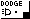

#  Casio Dodge
 A bullet hell game written for the CASIO fx-9860GIII (should also run on GII).
 This is a work in progress, but I've got the proof of concept (movement, rendering, collisions) working so now it's just design in terms of different projectile patterns
 
Preview of the game: https://www.youtube.com/watch?v=Af088etO-JU

## How to play?
There is an already compiled version in this repo, "DODGE.G1A" (see releases or just find this file). You can just transfer this file onto your calculator with the USB cable.
If you want to build it yourself, you will need to install the SDK.
### SDK installation instructions
- Go to  https://edu.casio.com/download/index.php
- Scroll down to where you see a heading saying "Graphing Models". Click the "See More" button under this.
- Scroll down to "fx-9860GII series" (it works for the GIII too, which is what I'm using, but isn't linked there)
- Open the "SDK heading"
- Download "*Version 1.00 (for Windows)" and use that installer. I don't know how to obtain this SDK on other operating systems, sorry.
